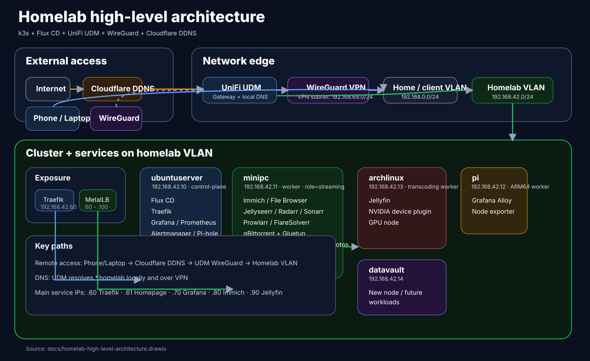

# Homelab

GitOps-powered home Kubernetes cluster built with k3s, Flux CD, SOPS/age, MetalLB, and UniFi networking.

## High-level architecture

## Highlights

- **Network edge**: UniFi UDM, WireGuard VPN, Cloudflare DDNS
- **Main VLANs**:
  - home/client VLAN: `192.168.0.0/24`
  - homelab VLAN: `192.168.42.0/24`
  - WireGuard VPN: `192.168.69.0/24`
- **Cluster nodes**:
  - `ubuntuserver` — control plane + Flux + monitoring
  - `minipc` — Immich, streaming stack, NFS storage
  - `archlinux` — Jellyfin + GPU transcoding
  - `pi` — ARM worker + observability
  - `datavault` — new node for future workloads
- **Service exposure**: Traefik at `192.168.42.60`, MetalLB pool `192.168.42.60-192.168.42.100`
